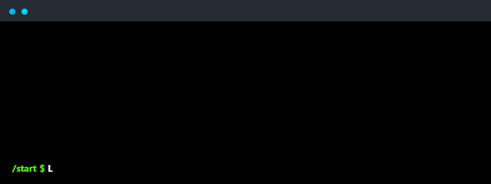

# Hi there! 👋🏻 I'm Victor
   
🚀 I'm actively seeking hackathons to participate in! Explore my notable achievements 👉🏻[here](https://victorfigma.github.io/portfolio/#hackathons)👈🏻.

🛠️ Specialized in Data Science, Artificial Intelligence, and Back-End. My tech toolkit includes prominent languages such as Python, Java, C++, and SQL, alongside proficiency in various others.

📈 Beyond tech, I bring a strong proficiency in business-related matters, ensuring a holistic approach to problem-solving and innovation.

📋 Learn more about my projects through my [portfolio](https://victorfigma.github.io/portfolio/).

   
  
   
   
  <a>PLEASE, DON'T TOUCH THIS BUTTON</a> <a href="https://victorfigma.github.io/portfolio/" style="text-decoration: none; color: inherit;"> 👉🏻🔴👈🏻</a>

